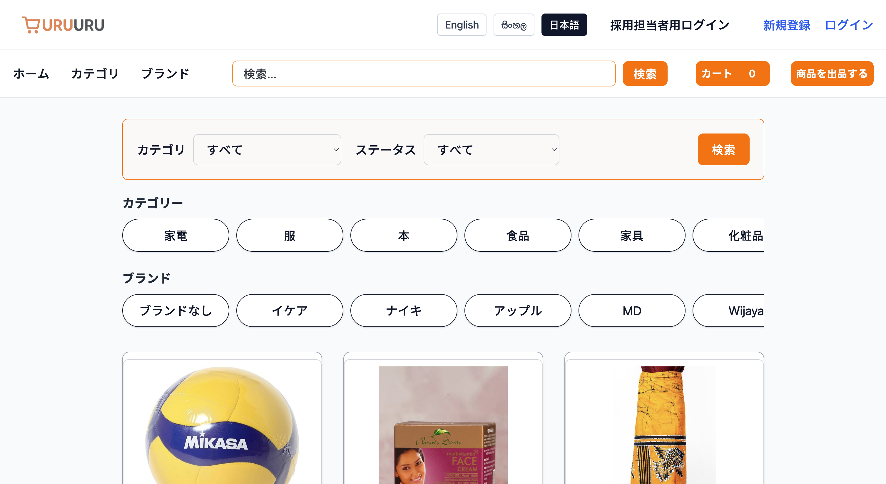
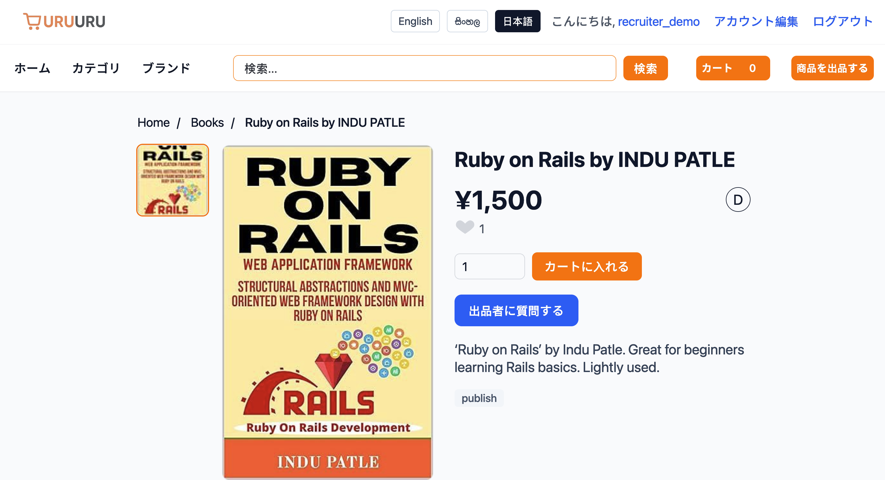
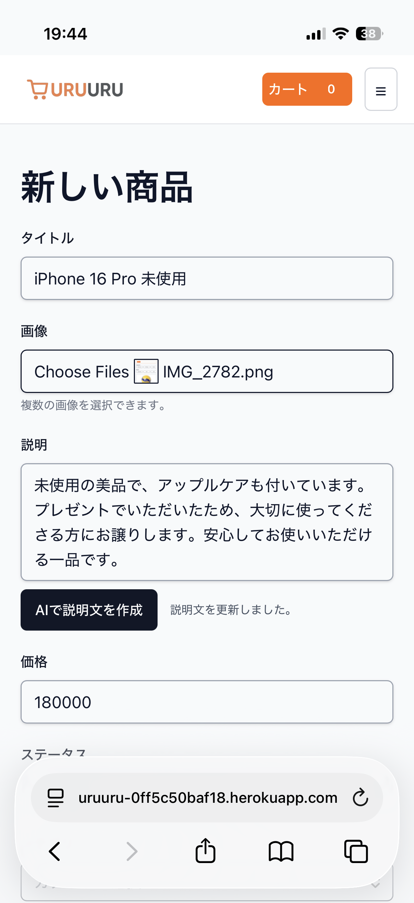
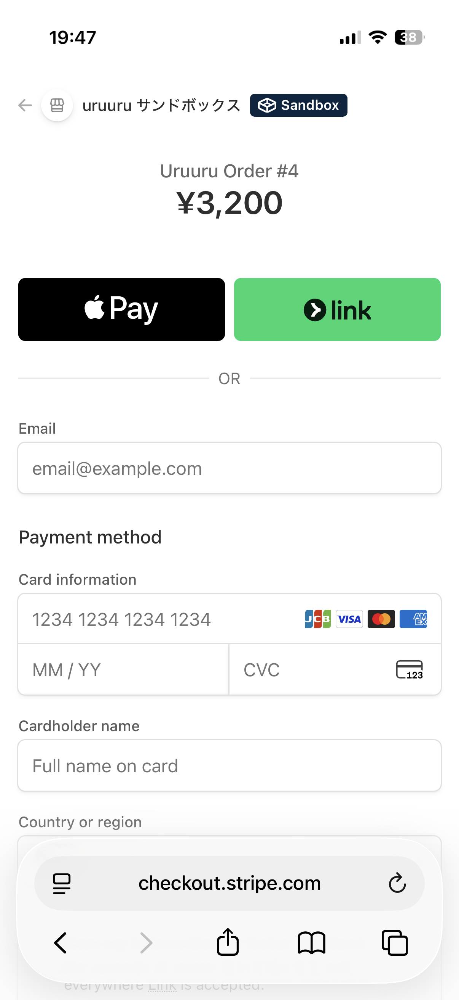
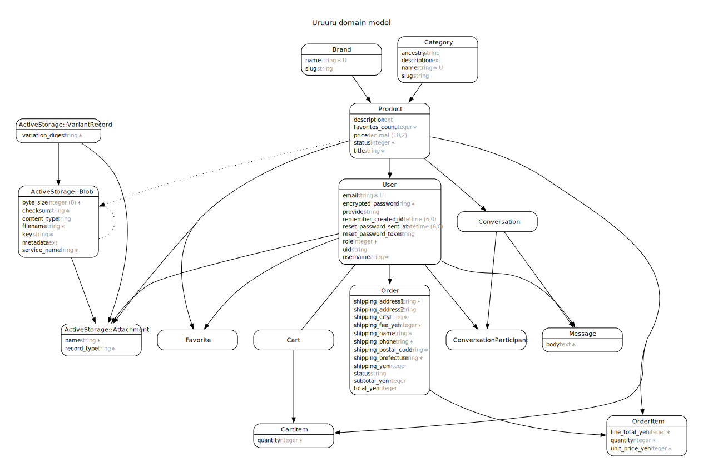

**English version available here → [README_EN.md](README_EN.md)**

<h2>Uruuru – 多言語対応フリマアプリ</h2>

1. サービス概要

Uruuru は、日本に住む外国籍ユーザーが “自分の言語で” 気軽に売買できることを目指して開発したフリマアプリです。

「日本語の壁」や「複雑な住所入力」「ログインの難しさ」を軽減するために、
	•	Facebookログイン
	•	住所自動入力（ZipCloud）
	•	多言語UI（英語 / 日本語 / シンハラ語）
	•	AIによる商品説明の補助（OpenAI API）

など、外国人視点の使いやすさを重視した設計にしています。

⸻

2. 開発背景

日本で生活する中で感じたのは、フリマアプリは外国人にとって使いづらいという現実でした。
	•	商品説明を日本語で書くのが大変
	•	郵便番号 → 住所の入力ルールが難しい
	•	電話番号必須で登録できないケース
	•	英語UIがない
	•	出品フローの違いがわかりづらい

こうした不便を解消するため、
**「外国人でも使いやすい日本のフリマ」**をテーマに企画し開発しました。

⸻

3. サービスURL

https://uruuru-0ff5c50baf18.herokuapp.com/
（採用担当者用ログインあり）

⸻

4. 主な特徴（現状実装済）

🔐 ログイン・認証
	•	Facebookログイン
	•	Deviseによるメールアドレスログイン
	•	Recruiter向けデモログイン

🌍 UI 多言語対応
	•	英語 / 日本語 / シンハラ語
	•	画面テキストをi18nで完全切り替え

🤖 AI 商品説明補助（OpenAI）

現在対応している機能:
	•	入力された情報から “箇条書きスタイルの商品説明” を生成
	•	空欄対策のフォールバックあり
	•	API Key 未設定時の安全処理

※機械翻訳機能は未実装（今後の展望に記載）

🏠 住所入力補助
	•	ZipCloud API による郵便番号 → 住所自動補完
外国人ユーザーが苦手な住所入力を簡略化。

🛍️ 出品〜購入
	•	商品の出品 / 編集 / 削除
	•	商品一覧（ブランド・カテゴリ別表示）
	•	商品詳細ページ
	•	商品の購入（カート → 注文）

📦 配送・送料計算
	•	都道府県別の送料ロジック
	•	Order作成時に自動計算
	•	Order確認メールの送信

💳 決済（Stripe）
	•	Stripe Checkout
	•	Apple Pay / クレジットカード対応
	•	決済成功 / キャンセル時の状態遷移

💬 メッセージ（買い手・売り手チャット）
	•	1対1メッセージ
	•	モバイル向けレイアウト最適化

✉️ 注文完了メール
	•	i18n対応
	•	購入情報 / 配送先を通知

⸻

4.5. 画面イメージ（Screenshots）

主要な画面のスクリーンショットを掲載しています。
各画像は /docs/screenshots/ 配下に保存しています。

### ホーム画面（デスクトップ）


### 商品詳細ページ


### 商品出品フォーム（AI説明生成つき）


### Stripe 決済画面（モバイル）


### 住所自動入力（ZipCloud）


### メッセージ機能（モバイル）

⸻

5. 使用技術

フロントエンド
	•	HTML / ERB
	•	Tailwind CSS v4
	•	Stimulus（モジュール単位、疎結合JS）
	•	Turbo

バックエンド
	•	Ruby 3.x
	•	Ruby on Rails 7.x
	•	PostgreSQL

外部API・サービス
	•	Facebook OAuth（ログイン）
	•	OpenAI API（商品説明補助）
	•	AWS S3（画像アップロード）
	•	ZipCloud（住所検索）
	•	Stripe Checkout（決済）

開発環境
	•	Heroku
	•	GitHub（コード管理）

⸻

6. アーキテクチャと設計方針
	•	MVCに忠実、Controllerは極力薄く
	•	Fat Modelを避けるためServiceオブジェクトを採用
	  •	Orders::CreateFromCart
	  •	Products::GenerateDescription
	•	Modelは責務ごとにscopeやvalidationを整理
	•	Viewはロジック最小化（helperで集約）
	•	StimulusによりUIの小さな動きをモジュール化
	•	i18nにより3言語を統一管理
	•	配送に関するビジネスロジックはOrderと専用サービスへ分離
	•	Rails標準機能を優先し、学習コストの低い実装を意識

⸻

7. ER 図



⸻

8. 今後の実装予定

🔜 近い将来（次のアップデート）
	•	商品タイトル・説明の機械翻訳機能（OpenAI or DeepL）
	•	検索ボックスのライブサジェスト（Vue.js）
	•	購入済み商品の “SOLD” バッジ表示
	•	出品者の評価機能
	•	全文検索（pg_search）

📅 その後
	•	メッセージリアルタイム化（ActionCable）
	•	閲覧履歴 / レコメンド機能
	•	モバイルアプリ化（React Native）
	•	配送オプションの細分化、複数住所登録

⸻

9. 開発者

脇 ラクシカ
Ruby on Rails 開発者
静岡 / 日本
使用言語: 英語 / 日本語 / シンハラ語

## 開発環境での実行方法（任意）

```bash
git clone https://github.com/lakshikaedm/uruuru.git
cd uruuru
bundle install
bin/rails db:setup
bin/dev
