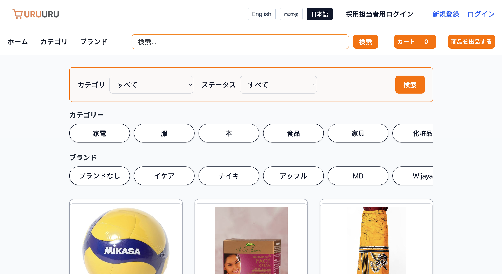
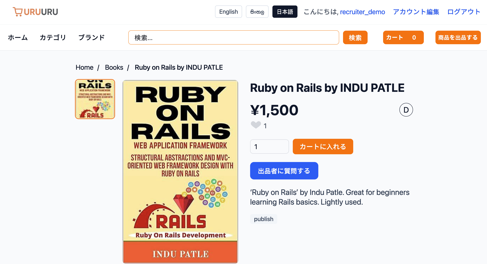
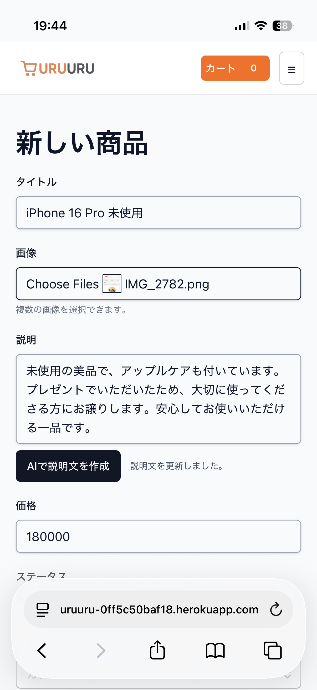
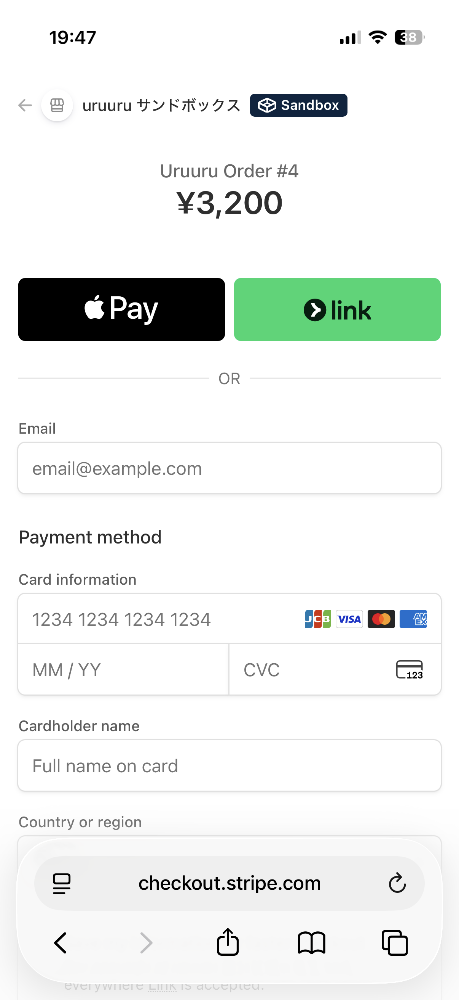
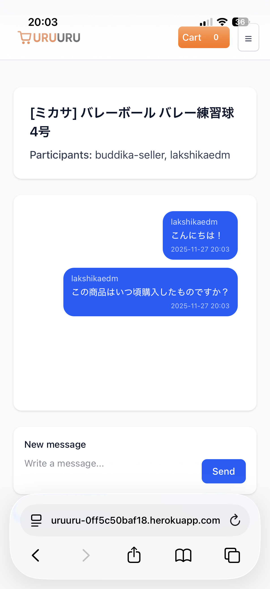
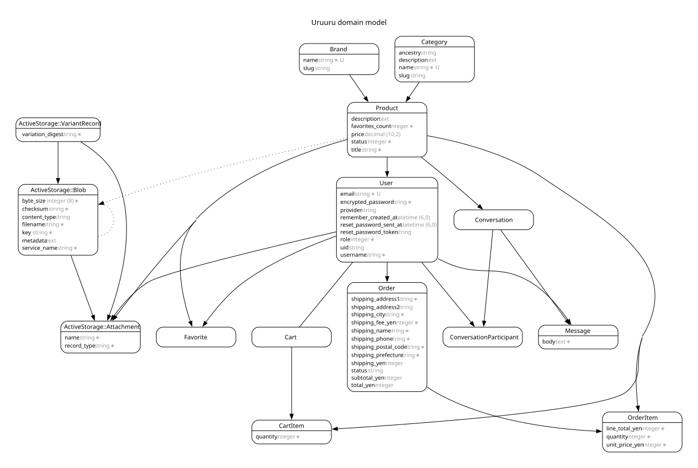

<h2>Uruuru – Multilingual Marketplace App for Foreign Residents in Japan</h2>

1. Overview

Uruuru is a multilingual marketplace app designed for foreign residents living in Japan.
The goal is to provide a simple, comfortable selling and buying experience in one’s own language, reducing common barriers such as:
	•	Japanese-only product descriptions
	•	Complicated address input formats
	•	SMS verification issues
	•	Lack of multilingual support

To solve these pain points, the app includes:
	•	Facebook Login
	•	Address auto-fill via ZipCloud API
	•	Full multilingual UI (English / Japanese / Sinhala)
	•	AI-assisted product description generation (OpenAI)

This app focuses on user-friendliness for non-Japanese speakers while maintaining production-level code quality.

⸻

2. Background

While living in Japan, I noticed that existing flea-market apps (Mercari, Rakuma, etc.) are difficult for many foreigners to use:
	•	Writing product descriptions in Japanese is challenging
	•	Postal address formatting is confusing
	•	Phone number requirements often prevent registration
	•	Interfaces rarely support English
	•	Listing flow differs from what many foreigners expect

To address these issues, I designed and developed a marketplace that foreign residents can actually use easily.

⸻

3. Service URL

https://uru-uru.com
(Recruiter demo login available)

⸻

4. Key Features (Implemented)

🔐 Authentication
	•	Facebook OAuth login
	•	Devise email/password login
	•	Recruiter/demo login

🌍 Multilingual UI
	•	English / Japanese / Sinhala
	•	Full i18n text switching

🤖 AI-Assisted Product Descriptions (OpenAI)
	•	Generates bullet-point product descriptions from user input
	•	Fallback messages when input is empty
	•	Safe handling when API key is missing

Machine translation is planned for future updates.

🏠 Address Auto-Fill
	•	ZipCloud API
	•	Auto-fills Japanese address from postal code
	•	Designed for users unfamiliar with Japanese address formatting

🛍️ Listing and Buying
	•	Product listing / editing / deleting
	•	Product categories & brands
	•	Product detail page
	•	Add to cart → checkout flow

📦 Shipping & Fees
	•	Prefecture-based shipping logic
	•	Automatically calculated during order creation
	•	Order confirmation email (i18n)

💳 Payments (Stripe)
	•	Stripe Checkout
	•	Apple Pay / credit card support
	•	Success/cancel flow handling

💬 Buyer–Seller Messaging
	•	1-on-1 chat
	•	Mobile-first UI design

✉️ Order Confirmation Email
	•	i18n support
	•	Includes purchase and shipping details

⸻

4.5 Screenshots

Key screens from the application
(All images stored in /docs/screenshots/)

Home (Desktop)

Product Detail

Product Creation (with AI generation)

Stripe Checkout (Mobile)

Address Auto-Fill (ZipCloud)

Chat (Mobile)

⸻

5. Technologies Used

Frontend
	•	HTML / ERB
	•	Tailwind CSS v4
	•	Stimulus (modular JS)
	•	Turbo

Backend
	•	Ruby 3.x
	•	Ruby on Rails 7.x
	•	PostgreSQL

External APIs / Services
	•	Facebook OAuth
	•	OpenAI API
	•	AWS S3 (ActiveStorage)
	•	ZipCloud
	•	Stripe Checkout

Infrastructure
	•	Heroku
	•	GitHub for version control

⸻

6. Architecture & Design Principles
	•	Strict adherence to MVC, with thin controllers
	•	Service Objects to avoid Fat Models
	•	Orders::CreateFromCart
	•	Products::GenerateDescription
	•	Models organized with scopes & validations
	•	Minimal logic in Views (delegated to helpers)
	•	Stimulus for modular, maintainable JS behavior
	•	Full multilingual support with i18n
	•	Shipping logic encapsulated in Order & service objects
	•	Preference for standard Rails features over unnecessary gems

⸻

7. ER Diagram

⸻

8. Roadmap

Upcoming
	•	Machine translation for title & description
	•	Live search suggestions (Vue.js)
	•	SOLD badge for purchased items
	•	Seller rating system
	•	Full-text search (pg_search)

Future
	•	Real-time messaging (ActionCable)
	•	Browsing history & recommendations
	•	Mobile app (React Native)
	•	Multiple shipping options / saved addresses

⸻

9. Developer

Waki Lakshika（脇 ラクシカ）
Ruby on Rails Developer
Shizuoka, Japan
Languages: English / Japanese / Sinhala
